# Talk2DAU API

A conversational AI chatbot API powered by Langchain and Groq LLM, designed to answer questions based on PDF documents. Built with FastAPI for high-performance REST API endpoints.

---

## Tech Stack

[](https://www.python.org/)
[](https://fastapi.tiangolo.com/)
[](https://www.langchain.com/)
[](https://groq.com/)
[](https://github.com/facebookresearch/faiss)
[](https://huggingface.co/docs/transformers/index)
[](https://pydantic.dev/)
[](https://www.uvicorn.org/)
[](https://pypi.org/project/python-dotenv/)
[](https://git-scm.com/)
[](https://github.com/)

- **Python** — Main programming language  
- **FastAPI** — Modern, fast web framework for building APIs  
- **Langchain** — Framework for building LLM-powered apps  
- **Groq LLM (ChatGroq)** — Large Language Model API for answering queries  
- **FAISS** — Vector similarity search library for document retrieval  
- **HuggingFace Embeddings** — To generate embeddings for documents  
- **Pydantic** — Data validation and settings management using Python type annotations  
- **Uvicorn** — Lightning-fast ASGI server for Python  
- **dotenv** — Load environment variables locally  
- **Git & GitHub** — Version control and code hosting


---

## Features

- **RESTful API** — Clean, well-documented API endpoints
- **PDF Document Processing** — Automatically process multiple PDF documents from the `files/` directory
- **Document Chunking** — Split documents into optimized chunks for better retrieval
- **Vector Search** — Use FAISS vector embeddings for fast document similarity search
- **Natural Language Queries** — Ask questions in natural language via API endpoints
- **LLM-Powered Answers** — Responses generated by Groq LLM based on document context
- **Source Attribution** — Returns relevant document chunks as references with each answer
- **High Performance** — Built with FastAPI for fast, async API responses
- **Interactive Documentation** — Auto-generated Swagger/OpenAPI documentation
- **Environment Configuration** — Secure API key management via environment variables




## Getting Started

### Prerequisites

- Python 3.8 or higher
- Git

### Installation

1. Clone the repo:

   ```bash
   git clone https://github.com/NT1906/Talk2DAU-API.git
   cd Talk2DAU-API
   ```

2. Create and activate a virtual environment (recommended):

   ```bash
   python -m venv venv
   source venv/bin/activate  # On Windows: venv\Scripts\activate
   ```

3. Install dependencies:

   ```bash
   pip install -r requirements.txt
   ```

4. Set up environment variables:

   Create a `.env` file in the project root with your API keys:

   ```env
   GROQ_API_KEY=your_groq_api_key_here
   LANGSMITH_API_KEY=your_langsmith_api_key_here
   ```

   **Note:** Never commit the `.env` file to version control. It's already included in `.gitignore`.

5. Prepare your PDFs:

   - Add your PDF files into the `files/` directory.

---

## Usage

### Starting the API Server

Run the API server locally:

```bash
python app.py
```

Or using uvicorn directly:

```bash
uvicorn app:app --reload --host 0.0.0.0 --port 8000
```

The API will be available at `http://localhost:8000`

### API Endpoints

#### 1. **Root Endpoint**
```http
GET /
```
Returns basic API information and disclaimers.

#### 2. **Initialize Bot**
```http
POST /initialize
```
Processes PDF documents and creates vector embeddings. Must be called before asking questions.

**Response:**
```json
{
  "status": "success",
  "message": "Bot initialized successfully",
  "documents_loaded": 25,
  "chunks_created": 1250
}
```

#### 3. **Ask Question**
```http
POST /ask
```

**Request Body:**
```json
{
  "question": "What are the admission requirements for BTech program?"
}
```

**Response:**
```json
{
  "answer": "The admission requirements for BTech program include...",
  "response_time": 2.34,
  "source_chunks": [
    {
      "chunk_id": 1,
      "source": "Academic requirements_BTech(ICT)2021.pdf",
      "content": "Relevant document excerpt..."
    }
  ]
}
```

#### 4. **Check Status**
```http
GET /status
```
Returns the current initialization status of the bot.

### Interactive API Documentation

Once the server is running, visit:
- **Swagger UI**: `http://localhost:8000/docs`
- **ReDoc**: `http://localhost:8000/redoc`

### Example Usage with curl

```bash
# Initialize the bot
curl -X POST "http://localhost:8000/initialize"

# Ask a question
curl -X POST "http://localhost:8000/ask" \
  -H "Content-Type: application/json" \
  -d '{"question": "What is the fee structure for MTech programs?"}'

# Check status
curl -X GET "http://localhost:8000/status"
```


## Notes

- This bot is **not affiliated with Dhirubhai Ambani University**.
- Misinformation may be generated — always verify answers independently.<br>

-Originally Created By:NT1906 https://github.com/NT1906/Talk2DAU.<br>
-Open Sourced By:vaishcodescape https://github.com/vaishcodescape.
